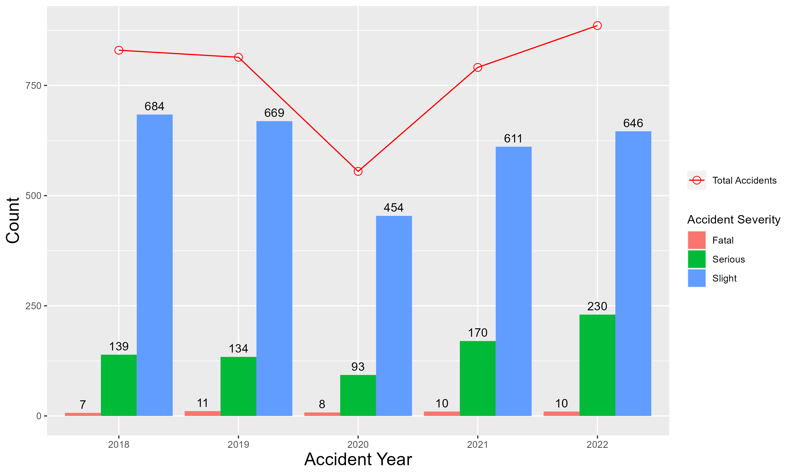
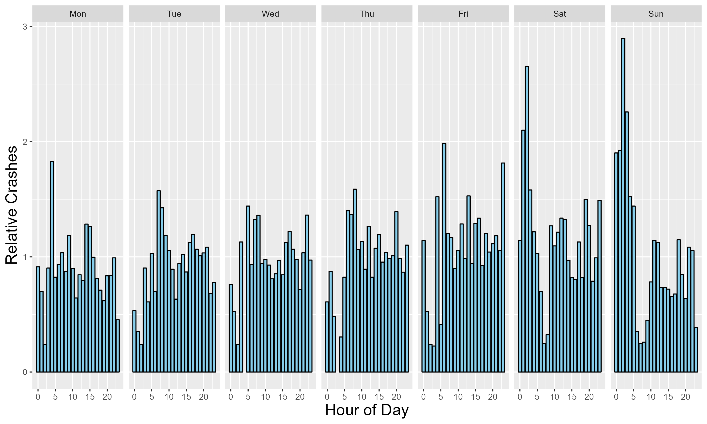
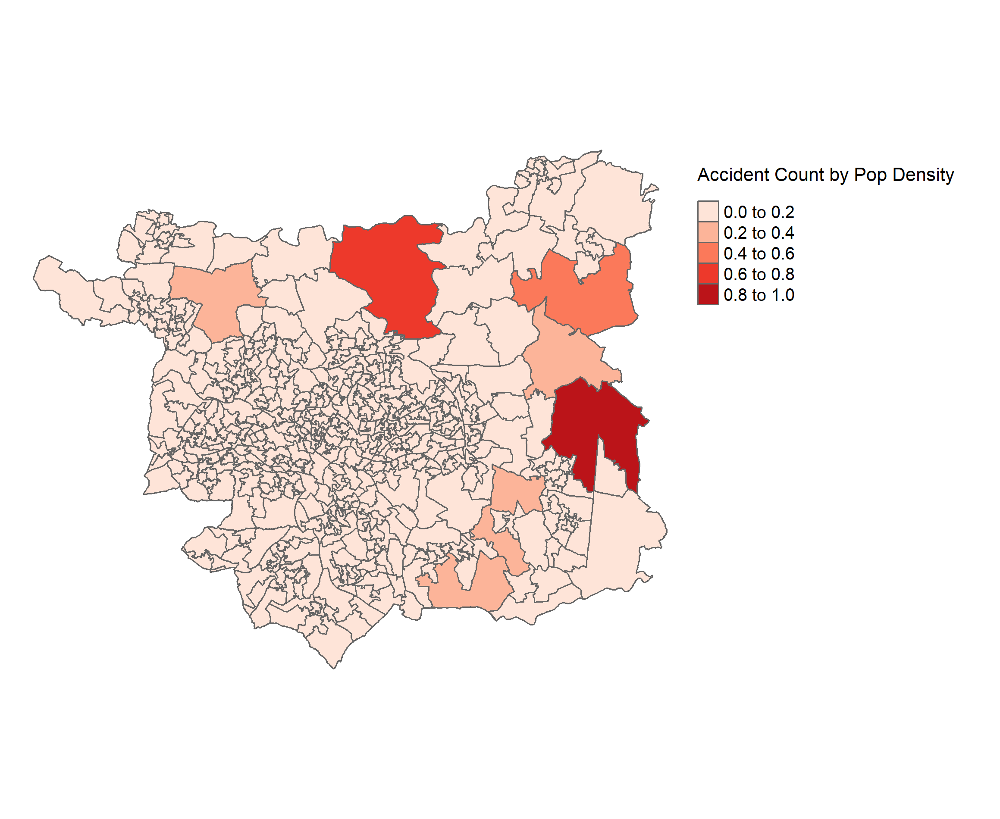
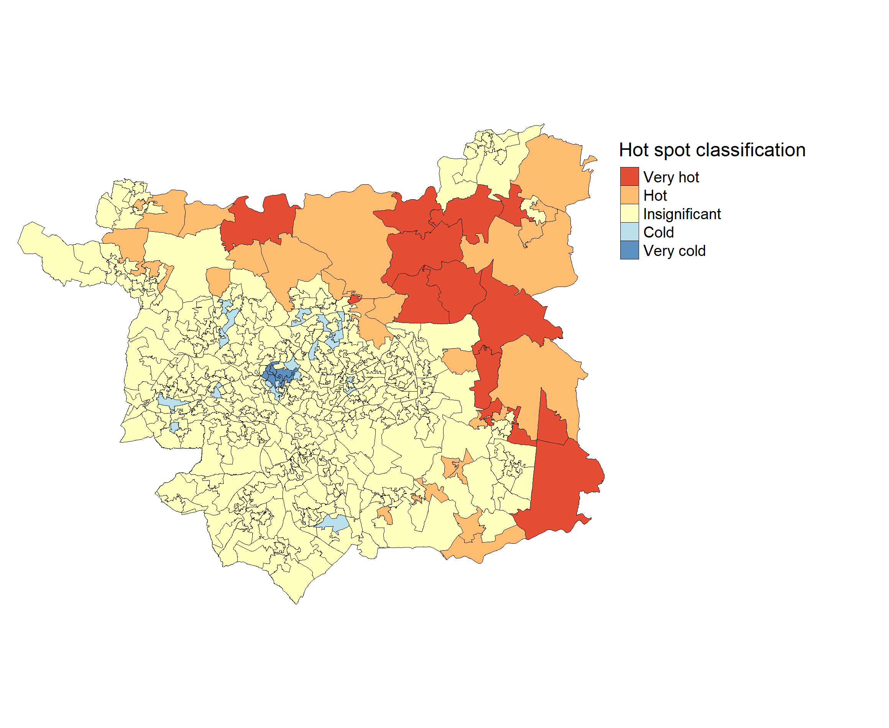
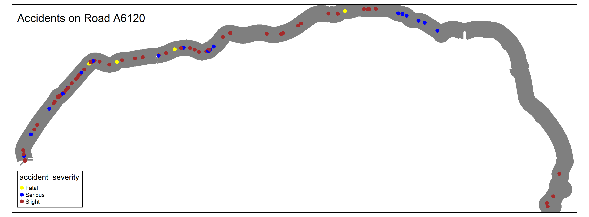
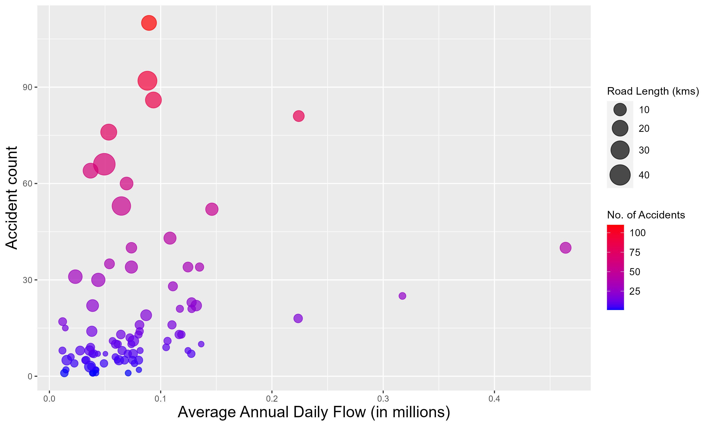
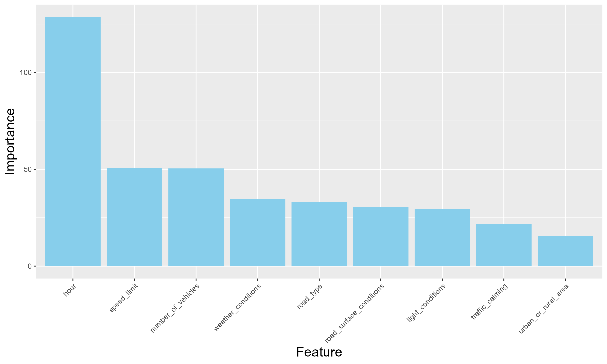
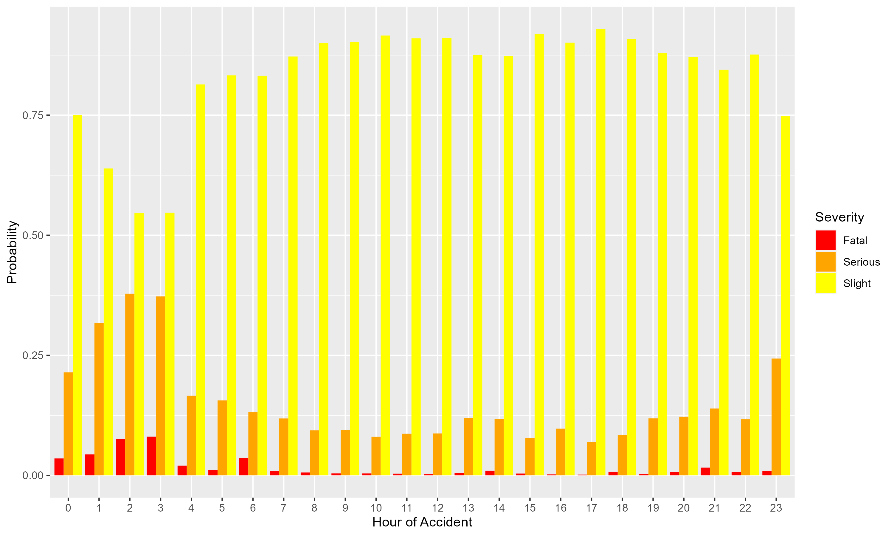

# Statement {-}

```
TRAN5340M
Transport Data Science
Assignment Title:	Road safety analysis of motorists and motorcyclists in Leeds
Student ID: 201792310
Word Count:	xxxx	
Lecturer: Dr. Robin Lovelace
Submission Date: 24-05-2024 (extended)		
Semester: 2			
Academic Year: 2024-25
Generative AI Category: AMBER
```


Use of Generative Artificial Intelligence (Gen AI) in this assessment:

I have used Gen AI only for the specific purposes outlined in my acknowledgements

By submitting the work to which this sheet is attached you confirm your compliance with the University’s definition of Academic Integrity as: “a commitment to good study practices and shared values which ensures that my work is a true expression of my own understanding and ideas, giving credit to others where their work contributes to mine”. Double-check that your referencing and use of quotations is consistent with this commitment.


```{r setup, include=FALSE}
knitr::opts_chunk$set(include = FALSE, 
                      eval = FALSE,
                      echo=FALSE,
                      fig.align="center", 
                      out.width="100%",
                      fig.pos="H") 
options(timeout = 600)
set.seed(123)

```


## Acknowledgements

Gen AI in this report has been used for:

- Literature review

- Generating references

- Debugging code

- Explaining important concepts

- Correcting grammar


\newpage

## 1. Introduction
Road accidents are a pressing public safety issue, posing significant risks to human life. Five people die every day on the road in the UK, and 82 are seriously injured on average [@govuk_2022]. The government has been actively involved in making policies to address road safety issues and cut down road deaths [@dft_2019]. This report aims to provide valuable insights on road safety of motorists and motorcyclists using transport data science approaches. The techniques used are hotspot analysis, black spot analysis, classification modelling and association rule mining.

## 2. Background
Existing studies have analysed various risk factors relating to accident severity. [@Kwon2015] inspected traffic accident reports accumulated by the California Highway Patrol (CHP) since 1973 for each accident report containing around 100 data fields. Among them, 25 fields between 2004 and 2010 were selected as the most relevant to car accidents. The analysis found five risk factors (including population) that majorly contributed to accident severity. Another study on road safety [@Daniels2020] analysed the reliability of freeway and state roads in the province of Cosenza (Italy) by defining the seriousness of the accidents. The report also emphasised that it is impossible to attribute the cause of an accident to a sole component of
the system ‘driver – vehicle – environment – infrastructure’.
There have also been multiple studies on hotspot analysis. In [@Anderson2009] a methodology using Geographical Information Systems (GIS) and Kernel Density Estimation was used to study the spatial patterns of injury related road accidents in London, UK. A clustering methodology was developed using environmental data and results from the spatial pattern analysis in order to create a classification of road accident hotspots. In [@kuyumcu2023] likelihood of accidents were analysed by investigating the possible relationships of risk factors using association rule mining.

## 3. Scope 
The report's analysis is structured into two parts. Both parts primarily use accident data pertaining to cars and motorcycles in Leeds from 2018 to 2022.

1. Part one analyses the accident data to find accident-prone areas on the LSOA and road level.

2. Part two analyses accident data to find the attributes most affecting the severity level.


## 4. Datasets used
The primary dataset used in this report is the collision (and casualty) data from the "stats19" package. Vector data for roads is extracted from open street maps through an overpass query built using the `osmdata` package. Boundary (LSOA) data for Leeds and population density data are obtained from the Office for National Statistics website. Road traffic flow data is obtained from the Department of Transport website.

```{r load_packages, include=TRUE, eval=TRUE, message=FALSE, warning=FALSE}

library(sf)
library(tidyr)
library(tibble)
library(tmap)
library(stats19)
library(knitr)
library(dplyr)
library(osmdata)
library(ggplot2)
library(spdep)
library(sfdep)
library(readr)
library(readxl)
library(lubridate)
library(units)
library(randomForest)
library(arules)

```

```{r #load_data_from_web}

# accident data for the years 2018-2022
ac_2018 = stats19::read_collisions(year=2018)
ac_2019 = stats19::read_collisions(year=2019)
ac_2020 = stats19::read_collisions(year=2020)
ac_2021 = stats19::read_collisions(year=2021)
ac_2022 = stats19::read_collisions(year=2022)

# collision data for the year 2018-2022
cas_2018 = stats19::get_stats19(year=2018,type = "cas")
#cas_2019 = stats19::read_casualties(year=2019)
cas_2019 = stats19::get_stats19(year=2019,type = "cas")
cas_2020 = stats19::get_stats19(year=2020,type = "cas")
cas_2021 = stats19::get_stats19(year=2021,type = "cas")
cas_2022 = stats19::get_stats19(year=2022,type = "cas")

# LSOA boundary data for Leeds
url = "https://borders.ukdataservice.ac.uk/ukborders/easy_download/prebuilt/shape/England_lsoa_2021.zip"
download.file(url,"data/lsoa.zip",)
unzip("data/lsoa.zip", exdir="data/")

```

```{r #write_raw_data_to_csv}

# write accident data to csv for loading
write_csv(ac_2018,"data/ac_2018.csv")
write_csv(ac_2019,"data/ac_2019.csv")
write_csv(ac_2020,"data/ac_2020.csv")
write_csv(ac_2021,"data/ac_2021.csv")
write_csv(ac_2022,"data/ac_2022.csv")

# write casualty data to csv for loading
write_csv(cas_2018,"data/cas_2018.csv")
write_csv(cas_2019,"data/cas_2019.csv")
write_csv(cas_2020,"data/cas_2020.csv")
write_csv(cas_2021,"data/cas_2021.csv")
write_csv(cas_2022,"data/cas_2022.csv")
```

```{r #load_data_from_csv}

# reading accident data
file_names_ac = list.files(path = "data/", pattern = "ac_20(1[89]|2[012]).csv", full.names = TRUE)
list_of_dfs_ac = lapply(file_names_ac, read.csv)

# combining accident data
ac_comb = bind_rows(list_of_dfs_ac)

# reading casualty data
file_names_cas = list.files(path = "data/", pattern = "cas_20(1[89]|2[012]).csv", full.names = TRUE)
list_of_dfs_cas = lapply(file_names_cas, read.csv)

# type casting 
list_of_dfs_cas[[2]]$lsoa_of_casualty = as.character(list_of_dfs_cas[[2]]$lsoa_of_casualty)

# combining casualty data
cas_comb = bind_rows(list_of_dfs_cas)

# reading boundary data
lsoa_data = read_sf("data/england_lsoa_2021.shp")

```


### 4.1 Data preparation 
Since collision data from "stats19" is the primary data set used, we will illustrate the data preparation methods used in context of combined collision data.


```{r # missing values}

# checking for missing values in the variables
DataExplorer::plot_missing(ac_comb)
colSums(is.na(ac_comb)) 
rowSums(is.na(ac_comb)) 

```


```{r #getting boundary data for leeds}

# filtering boundary data for Leeds
leeds_lsoa = lsoa_data[grep("Leeds", lsoa_data$lsoa21nm), ]
head(leeds_lsoa)

```

```{r # writing shp file}

write_sf(leeds_lsoa,"data/leeds_lsoa.shp")
write_sf(leeds_lsoa,"datasets/leeds_lsoa.shp")

```


```{r # reading the shapefile, eval = TRUE}

leeds_lsoa = read_sf("datasets/leeds_lsoa.shp")

```


```{r #selecting relevant data}

colnames(ac_comb)

# accident index contains inf values
sum(is.infinite(ac_comb$accident_index))

# selecting relevant columns and filtering data for leeds
leeds_ac_comb = ac_comb %>% select("accident_reference",
                                   "accident_year",
                                   "location_easting_osgr",
                                   "location_northing_osgr",
                                   "accident_severity",
                                   "number_of_vehicles",
                                   "number_of_casualties",
                                   "date",
                                   "time",
                                   "road_surface_conditions",
                                   "local_authority_ons_district",
                                   "road_type",
                                   "urban_or_rural_area",
                                   "speed_limit",
                                   "light_conditions",
                                   "weather_conditions",
                                   "lsoa_of_accident_location") %>% 
  filter(lsoa_of_accident_location %in% leeds_lsoa$lsoa21cd)

ncol(ac_comb)
ncol(leeds_ac_comb)

```


- We combine the data for all years using the `bind_rows()` function. Prior to combining the data sets, `lsoa_of_casualty` column of the `cas_2019` dataset had to be converted to `character` class. The variable `accident_index` contained `inf` values so we use the key `accident_reference` for data linkage. Since the `local_authority_district` variable was missing for the years 2021 and 2022, LSOA (lower super output area) data for Leeds was used to filter the records. Out of the 37 variables provided, 17 were chosen for further analysis. 


```{r #joining casualty data}

# selecting relevant columns and filtering car and motorcycle accidents
leeds_ac = cas_comb %>% select("accident_reference",
                          "casualty_type") %>% 
  right_join(leeds_ac_comb, by=c("accident_reference" = "accident_reference")) %>% 
  filter(casualty_type %in% c("Car occupant",
                              "Taxi/Private hire car occupant",
                              "Motorcycle 125cc and under rider or passenger",
                              "Motorcycle over 125cc and up to 500cc rider or  passenger",
                              "Motorcycle 50cc and under rider or passenger",
                              "Motorcycle over 500cc rider or passenger",
                              "Motorcycle - unknown cc rider or passenger"))


# taking only unique accidents
leeds_ac_unq = leeds_ac %>% 
  distinct(accident_reference, .keep_all = TRUE) 

nrow(leeds_ac_comb)
nrow(leeds_ac_unq)

```

- To get the casualty type of the collision, we join the casualty data sets obtained from the `stats19` package to the collision data using the `right_join()` function on the column `accident_reference`. Data for motor cycles and cars is filtered using the `casualty_type` field. Since one accident can be linked to multiple casualties, the joined data set contained duplicate rows which were removed. Out of the 6737 total accidents in Leeds, 3876 records were filtered for final analysis. 

```{r #appropiate class naming and date-time processing}

# classes for casualty type
cas_type = unique(leeds_ac_unq$casualty_type)

class(leeds_ac$date)

# regrouping casualty type and processing date and time
leeds_final = leeds_ac_unq %>% mutate(casualty_type = case_when(casualty_type %in%
                                                                  c(cas_type[1],
                                                                    cas_type[2]) ~ 
                                                    "Car",
                                                  casualty_type %in% c(cas_type[3],
                                                                       cas_type[4],
                                                                       cas_type[5],
                                                                       cas_type[6],
                                                                       cas_type[7]) ~
                                                    "Motorcycle")) %>% 
  mutate(date = ymd(date),
         time = hms(time)) %>% 
  mutate(dow = wday(date, label=TRUE),
         hour = hour(time)) %>% 
  select(-"date",
         -"time",
         -"local_authority_ons_district")

head(leeds_final)

```

```{r #write as csv}

write_csv(leeds_final,"data/leeds_final.csv")
write_csv(leeds_final,"datasets/leeds_final.csv")

```

- Only values corresponding to "Car" and "Motorcycle" are selected for the variable `casualty_type`. Date and time are converted into appropriate formats using the `lubridate` package and day of the week and hour of accident occurrence is extracted.   

### 4.2 Exploratory data analysis

```{r read final crash csv, eval = TRUE}

# reading the final crash data
leeds_df = read_csv("datasets/leeds_final.csv")

```
```{r #summary}

summary(leeds_df)

```
Summary statistics for the dataset reveal that the average number of casualties per accident is 1.4 and the median speed limit for the roads is 30 mph.

```{r #eda1}

# Summarize the data by year and severity
severity_summary = leeds_df %>%
  group_by(accident_year, accident_severity) %>%
  summarize(count = n()) %>%
  ungroup()

# Summarize the total number of accidents per year
total_summary = leeds_df %>%
  group_by(accident_year) %>%
  summarize(total_accidents = n()) %>%
  ungroup()

# join the severity and total accidents data
plot_data = severity_summary %>%
  left_join(total_summary, by = "accident_year")

#plot
f1 = ggplot(plot_data, aes(x = factor(accident_year), y = count, fill = accident_severity)) +
  geom_bar(stat = "identity", position = "dodge") +
  geom_text(aes(label = count), position = position_dodge(width = 0.9), vjust = -0.5) +
  geom_point(aes(y = total_accidents, color = "Total Accidents"), size = 3, shape = 21, fill = "white") +
  geom_line(aes(x = as.numeric(factor(accident_year)), y = total_accidents, color = "Total Accidents", group = 1)) + # Adding a line to connect points
  scale_color_manual(values = c("Total Accidents" = "red"), name = "") +
  labs(x = "Accident Year",
    y = "Count",
    fill = "Accident Severity"
  )+
  theme(axis.title.x = element_text(size = 16), 
        axis.title.y = element_text(size = 16))

ggsave("figures/eda1.png", plot = f1, width = 10, height = 6)
```

Figure 1 shows the number of accidents for each year from 2018-2022 grouped by severity. We can see a sharp dip in the total number of accidents for the year 2020, likely due to the lock down imposed. Overall, the number of accidents seem to rise each year with a significant increase in the count of serious injuries.


```{r #eda2}

# calculating relative crashes
crash_rel = leeds_df %>%  
  select(dow, hour) %>%            
  group_by(hour) %>%             
  mutate(n_per_hour = n()/7) %>%  
  group_by(dow, hour) %>%         
  summarise(n_hday = n(), n_h = first(n_per_hour)) %>% 
  mutate(hday_relative = n_hday / n_h)

# converting dow as factor
crash_rel$dow = factor(crash_rel$dow, levels=c("Mon","Tue","Wed","Thu","Fri","Sat","Sun"))

head(crash_rel)

#plot
f2 = crash_rel %>% 
  ggplot(aes(x = hour, y = hday_relative)) +
  geom_col(fill = "skyblue", color = "black") +  # Adjust fill and outline color
  facet_wrap(~dow, nrow = 1) +
  labs(x = "Hour of Day",
    y = "Relative Crashes",
    fill = NULL  # Remove legend title
  ) +
  theme(axis.title.x = element_text(size = 16), 
        axis.title.y = element_text(size = 16))

ggsave("figures/eda2.png", plot = f2, width = 10, height = 6)

```


Figure 2 [@Lovelace2020] shows the proportion of accidents for each day of the week per hour. It can be seen that the highest proportion of accidents occur after Friday night and Saturday night. 


```{r display plots, eval=TRUE, echo=FALSE, include=TRUE, out.width="70%", fig.cap=c("Accident count per year by severity", "Proportion of accidents per day per hour")}




```

## 5. Hotspot Analysis

Hotspot analysis is a mapping technique used to identify clustering of spatial phenomena. A hotspot can be defined as an area that has a higher or lower concentration of events compared to the expected number of a random distribution of events. There are many techniques available for analysing hotspots. We will use the Getis Ord $Gi^*$ statistic for our analysis.

The Getis Ord local statistic is given by 
$$ Gi^*(i) = \frac{\sum_{j=1}^{n} w_{ij} \cdot x_j - \bar{x} \cdot \sum_{j=1}^{n} w_{ij}}{s \cdot \sqrt{\frac{n \cdot \sum_{j=1}^{n} w_{ij}^2 - (\sum_{j=1}^{n} w_{ij})^2}{(n-1) \cdot n}}} $$
where,
$x_j$ is the attribute value for feature j, $w_{ij}$ is the feature weight between feature i and j, n is the number of features,
$\bar{x} = \frac{\sum_{j=1}^{n} x_j}{n}$, and $s = \sqrt{\frac{\sum_{j=1}^{n} x_j^2}{n} - {\bar{x}^2}}$ [@Ord2010]

The $Gi^*$ statistic returned for each feature in the dataset is a z-score.


### 5.1 Methodology

We will use the accident count by population density for each LSOA as the target variable for clustering. Population density data is obtained from the ONS website and joined with the grouped LSOA accident data for Leeds. Following this, we calculate the data's global and local Gi statistics using the `spdep` and `sfdep` packages. Finally we classify the LSOAs into five categories - "Very Hot",, "Hot", "Insignificant", "Cold", "Very Cold" based on the local Gi values and the corresponding p values. Relevant plots for each step are also shown.


```{r #population density data}

url = "https://www.ons.gov.uk/file?uri=/peoplepopulationandcommunity/populationandmigration/populationestimates/datasets/lowersuperoutputareapopulationdensity/mid2021andmid2022/sapelsoapopdensitytablefinal.xlsx"

download.file(url,"data/pop_den.xlsx")

```


```{r #loading the data}

pop_den = read_excel("data/pop_den.xlsx", sheet = "Mid-2021 LSOA 2021", skip=3)

pop_den_lds = pop_den %>% filter(`LAD 2021 Name`=="Leeds") %>% 
  select("LSOA 2021 Code", "People per Sq Km") %>% 
  rename(LSOA = "LSOA 2021 Code",
         pop_den = "People per Sq Km")
pop_den_lds
```


```{r # writing into csv}

write_csv(pop_den_lds, "data/pop_den_lds.csv")
write_csv(pop_den_lds, "datasets/pop_den_lds.csv")

```


```{r # reading csv, eval = TRUE}

leeds_pop_den = read_csv("datasets/pop_den_lds.csv")

```


```{r #accident counts by population density, eval = TRUE}

lsoa_crash = leeds_df %>% 
  select("lsoa_of_accident_location") %>% 
  group_by(lsoa_of_accident_location) %>% 
  summarize(accidents = n())

lsoa = leeds_lsoa %>% left_join(lsoa_crash, by = c("lsoa21cd" = "lsoa_of_accident_location")) %>% 
  select("accidents","lsoa21cd","geometry") %>% 
  mutate(accidents = if_else(is.na(accidents), 0, accidents)) %>% 
  left_join(leeds_pop_den, by = c("lsoa21cd" = "LSOA")) %>% 
  mutate(ac_by_pop_den = accidents/pop_den)

```


```{r #plotting accident count}
#tmap.mode("view)

tm_shape(lsoa) +
  tm_fill(col = "ac_by_pop_den", style = "quantile", palette = "Reds") +
  tm_borders() +
  tm_layout(legend.position = c("left", "bottom"))


acc_count = tm_shape(lsoa) +
  tm_fill(
    col = "ac_by_pop_den", 
    palette = "Reds", 
    title = "Accident Count by Pop Density"
  ) +
  tm_borders() +
  tm_layout(
    legend.outside = TRUE,       
    legend.title.size = 1.7,    
    legend.text.size = 0.8,     
    frame = FALSE
  )

lsoa %>% filter(ac_by_pop_den==max(ac_by_pop_den))

tmap_save(acc_count,"figures/acc_count.png")

```


```{r #global Gi statistic, eval = TRUE}

# computing the nieghbors matrix
ac_nbs = lsoa %>% mutate(
  nb = st_contiguity(geometry),
  wt=st_weights(nb),
  lag = st_lag(ac_by_pop_den, nb, wt)
)

#global Gi statistic
global_g_test(ac_nbs$ac_by_pop_den, ac_nbs$nb, ac_nbs$wt)

```

```{r #local Gi statistic, eval = TRUE}

# calculating local Gi statistic
ac_hotspots = ac_nbs %>% mutate(
  Gi = local_g_perm(ac_by_pop_den, nb, wt, nsim=999)
) %>% 
  unnest(Gi) 
```


```{r # plot}
# plot Gi
ac_hotspots %>% 
  ggplot(aes(fill = gi)) +
  geom_sf(color="black", lwd= 0.15) +
  scale_fill_gradient2()

```


```{r #classifying hotspots, eval = TRUE}

hotspots = ac_hotspots %>% select(lsoa21cd, gi, p_folded_sim, accidents) %>% 
  mutate (classification = case_when(
    gi > 0 & p_folded_sim <= 0.01 ~ "Very hot",
    gi > 0 & p_folded_sim <= 0.05 ~ "Hot",
    gi < 0 & p_folded_sim <= 0.01 ~ "Very cold",
    gi < 0 & p_folded_sim <= 0.05 ~ "Cold",
    TRUE ~ "Insignificant"
  ),
  classification = factor(
    classification,
    levels = c("Very hot",
               "Hot",
               "Insignificant",
               "Cold",
               "Very cold"))
  
  ) 
```


```{r # plotting hotspots}
'hp_fig = hotspots %>% 
    ggplot(aes(fill=classification)) +
    geom_sf(color="black", lwd=0.1) +
    scale_fill_brewer(type="div", palette = 5)+
    labs(fill="Hot spot classification")
  
ggsave("figures/hp_fig.png", plot = hp_fig, width = 10, height = 6)'

hp_fig = tm_shape(hotspots) +
  tm_fill(
    col = "classification",       
    palette = "RdYlBu",           
    title = "Hot spot classification"  
  ) +
  tm_borders(
    col = "black",                
    lwd = 0.1                     
  ) +
  tm_layout(
    legend.outside = TRUE,        
    legend.title.size = 1.2,      
    legend.text.size = 0.8,       
    frame = FALSE,                
    bg.color = "white",           
    inner.margins = c(0, 0, 0, 0) 
  )
hp_fig

tmap_save(hp_fig,"figures/hp_fig.png")
```


### 5.2 Results

Figure 4 shows the accident counts by the population density (people per sq km). The LSOA with the highest proportion of car and motorcycle accidents is "E01011297", Harewood, Elmet And Rothwell, Leeds. One possible reason could be that it is located on the outskirts and experiences high vehicular traffic. There have also been multiple drunk driving cases in the area, including the Whitlam case.[@WharfedaleObserver2017]


```{r display acc_count, eval=TRUE, echo=FALSE, include=TRUE, out.width="70%", fig.cap="Accidents per person per sq Km"}



```


```{r display hotspots, eval=TRUE, echo=FALSE, include=TRUE, out.width="75%", fig.cap="Accident hotspots by population density for Leeds"}



```

The global G statistic is calculated as 1.07e-02, which is statistically significant (p-value = 3.21e-11), indicating that there is some level of clustering present in the data. The results of the local G test are summarized in Figure 5.


It can be observed from Figure 5 that most of the car and motorcycle crashes occur along the northern and eastern boundary of Leeds which is evident by the presence of "Hot" and "Very Hot" regions in the area. Minor LSOAs in the central parts of the city witness little to no accidents as compared to the average. 


## 5.4 Analyzing A6120

The major highway in the "accident-prone" region is "A6120," which is the outer ring road between Horsforth and Pudsey. Analysing the road closely, it was found that out of the 303 accidents recorded in the "Very Hot" and "Hot" regions, 101 were located within 10m of "A6120." Four of these accidents were fatal.  

Leeds City Council has already introduced comprehensive safety proposals to significantly enhance 'A6120' and ensure safer travel [@LeedsCityCouncil2014]. 


```{r #getting accident data for A6120, eval = TRUE}

rd_osm_leeds = 
  opq("leeds uk") %>% 
  add_osm_feature(key = "highway", value = c("motorway",
                                             "trunk",
                                             "primary")) %>% 
  osmdata_sf()


a6120 = rd_osm_leeds$osm_lines %>% 
  filter(ref=="A6120") %>% 
  group_by(ref) %>% 
  summarize(count=n()) %>% 
  select("ref") %>% 
  st_transform(crs="EPSG: 27700")

acc_sf = leeds_df %>%
  select("accident_reference",
         "accident_severity",
         "location_easting_osgr",
         "location_northing_osgr") %>% 
  st_as_sf(coords=c("location_easting_osgr", "location_northing_osgr"), crs="EPSG:27700")


acc_a6120 = acc_sf %>% 
  st_join(a6120, join=st_is_within_distance, dist=10) %>% 
  filter(!is.na(ref))

nrow(acc_a6120)
sum((hotspots[hotspots$classification %in% c("Very Hot", "Hot"),])$accidents)

nrow(acc_a6120[acc_a6120$accident_severity=="Fatal",])

```


```{r #plotting the data}

a_6120 = tm_shape(a6120) +
  tm_lines(lwd = 30, col = "gray50", lty = "solid", legend.show = FALSE) +
  tm_shape(acc_a6120) +
  tm_dots(col = "accident_severity", palette = c("yellow", "blue", "brown"),
          size = 0.22, legend.show = TRUE) +
  tm_layout(title = "Accidents on Road A6120",
            legend.position = c("left", "bottom"),
            legend.bg.color = "white",
            legend.frame = TRUE)

tmap_save(a_6120,"figures/a_6120.png")

```


```{r display a6120, eval=TRUE, echo=FALSE, include=TRUE, out.width="80%", fig.cap="Accidents on A6120"}



```


## 6. Black spot analysis

Black spots are hazardous locations where road traffic collisions have historically been concentrated. Countries are increasingly using it to enhance road safety. We will refer to the black spot manual proposed by KGM (General Directorate of Highways in Turkey) [@BlackSpotManual2001] to identify black spots for roads in Leeds.

The KGM black spot manual mentions a statistical method called Rate – Quality – Control for identifying black spots. It consists of calculating three different parameters for each road section:
1. Accident rate
2. Accident frequency
3. Severity index

Each of these parameters is compared to a critical value. If a certain road section shows higher values than the critical ones, it is considered a black spot. For our analysis, we will only consider the first two parameters, "Accident rate" and "Accident frequency."

**Accident Rate:**
A road segment j is considered a black spot in terms of accident rate if:\
$$(A_j/m_j) > R_c, \hspace{3mm} R_c = \hat{\lambda}+k_{\alpha}\sqrt{\hat{\lambda}/m_j}-0.5/m_j$$\
where,\
$A_j$ = Number of accidents on road j during the time period.\
$m_j$ = Number of vehicle kilometers in millions on road j during the same time period.\
$\hat{\lambda} = \sum_{i=1}^n A_i/\sum_{i=1}^n m_i$, n is the total number of road sections.\
$k_{\alpha}$ is a constant chosen to set the significance level.

**Accident frequency:**
A road segment j is considered a black spot in terms of accident frequency if:\
$$A_j > A_c, \hspace{3mm} A_c = F_{ave} + k_{\alpha}\sqrt{F_{ave}/L_j} - 0.5/L_j$$ \
where,\
$F_{ave}$ = Average accident frequency for all road sections.\
$L_j$ = Length of the $j^{th}$ road.


### 6.1 Methodology
We obtain the vector data for "motorway", "primary", and "trunk" roads from Open Street Map using the `osm_data` package. Average annual daily flow data is obtained from the Department For Transport website to find the vehicle kilometres travelled on each road. Crash locations are joined to the nearest road within 50 m of the crash. Out of the 313 roads, only  163 were mapped to corresponding crashes. Traffic flow is measured using count points, which are joined to the road data using the `st_join()` function. Since count point data is unavailable for all roads, the joined dataset comprised 85 records. The significance level was chosen at 1%. Finally, the parameters for accident rate and frequency are computed and interpreted for the final dataset.


```{r #getting road data, eval = TRUE}

road_lds = rd_osm_leeds$osm_lines %>% select("osm_id", "name", "highway", "geometry")

colSums(is.na(road_lds))

road_lds_f = road_lds %>% 
  filter(!is.na(name)) %>% 
  group_by(name) %>% 
  summarize(count = n(),
  geometry = st_union(geometry))

```


```{r #joining road data and Leeds crash data, eval = TRUE}

crash_lds = leeds_df %>% 
  select("accident_reference",
         "number_of_casualties",
         "location_easting_osgr",
         "location_northing_osgr") %>% 
  st_as_sf(coords = c("location_easting_osgr","location_northing_osgr"),crs="EPSG:27700")

st_crs(road_lds_f)

road_lds_f = st_transform(road_lds_f, crs = "EPSG:27700")

road_crash = road_lds_f %>% 
  st_join(crash_lds,join = st_is_within_distance, dist = 50) %>% 
  select("name","accident_reference") %>% 
  filter(!is.na(accident_reference)) %>% 
  group_by(name) %>% 
  summarize(n_ac = n()) %>% 
  arrange(desc(n_ac))

```


```{r # plotting road crash data}

tm_shape(road_lds_f) +
  tm_lines(col = "gray", lwd = 2) +
  tm_shape(crash_lds) +
  tm_dots(col = "red", size = 0.03) +
  tm_basemap("OpenStreetMap") +
  tm_layout(
    title = "Roads and Accidents Map",
    legend.outside = TRUE,
    legend.title.size = 1.2,
    legend.text.size = 0.8,
    frame = FALSE
  )

```


```{r #getting AADF data from DfT}

url = "https://storage.googleapis.com/dft-statistics/road-traffic/downloads/aadf/local_authority_id/dft_aadf_local_authority_id_63.csv"

download.file(url, "data/aadf.csv")

```

```{r #loading AADF data}

aadf = read_csv("data/aadf.csv")

aadf = st_as_sf(aadf, coords = c("easting","northing"), crs = "EPSG:27700")

```


```{r #joining aadf and road crash data}

black_spot_data = road_crash %>% st_join(aadf, join=st_is_within_distance, dist=10) %>% 
  select("name", "n_ac", "count_point_id", "year", "two_wheeled_motor_vehicles", "cars_and_taxis") %>% 
  filter(year %in% c(2018,2019,2020,2021,2022) & !is.na(count_point_id)) %>% 
  group_by(name,year) %>% 
  summarize(n_ac=mean(n_ac), 
            motorcycles = mean(two_wheeled_motor_vehicles), 
            cars = mean(cars_and_taxis)) %>% 
  ungroup() %>% 
  group_by(name) %>% 
  summarize(n_ac = mean(n_ac),
            motorcycles = sum(motorcycles),
            cars = sum(cars)) %>% 
  mutate(total_aadf = cars+motorcycles) %>% 
  select("name","n_ac","total_aadf") %>% 
  ungroup()
  
black_spot_data$length = st_length(black_spot_data) 
black_spot_data$length = set_units(black_spot_data$length,"km")
black_spot_data$total_aadf = black_spot_data$total_aadf/1000000

#black_spot_data$total_aadf = black_spot_data$total_aadf * black_spot_data$length

head(black_spot_data)

```

```{r #writing black spot data to shp file}

write_sf(black_spot_data,"data/black_spot.shp")
write_sf(black_spot_data,"datasets/black_spot.shp")

```


```{r #computing parameters, eval = TRUE}

bs_data = read_sf("datasets/black_spot.shp")

k_alp = 2.576
lmbda = sum(bs_data$n_ac)*sum(bs_data$total_aadf)

black_spot = bs_data %>% 
  mutate(a_j = n_ac,
         a_c = mean(n_ac) + k_alp*sqrt(mean(n_ac)/as.numeric(length)) - 0.5/as.numeric(length),
         r_j = as.numeric(n_ac)/as.numeric(total_aadf),
         r_c = lmbda + k_alp*sqrt(lmbda/as.numeric(total_aadf)) - 0.5/as.numeric(total_aadf)
  )


top_7 = black_spot %>% 
  filter(a_j>a_c) %>%
  st_drop_geometry() %>% 
  select("name","n_ac") %>% 
  arrange(desc(n_ac)) %>% 
  rename(number_of_accidents="n_ac") %>% 
    slice_head(n=7)

top = black_spot %>% 
  filter(a_j>a_c) %>%
  st_drop_geometry() %>% 
  select("name","n_ac") %>% 
  arrange(desc(n_ac)) %>% 
  rename(number_of_accidents="n_ac") 

```


### 6.2 Results
There were no significant roads that can be considered black spots in the "accident rate" domain. The critical value $R_c$ was much higher than the computed value, which assures that the accident rate is quite low, taking into account the daily traffic on the roads. 

Appendix A mentions the 20 roads with a higher accident frequency parameter value than the critical value. These roads experienced a greater frequency of accidents than the other roads. The top seven significant roads, ordered by the number of accidents, are shown below in Table 1.


```{r #display table, include=TRUE, echo=FALSE, eval = TRUE}

kable(top_7, caption = "Top 7 roads by accident count")

```

```{r #plot for aadf, length, n_ac}

bs_plot = ggplot(bs_data, aes(x = total_aadf, y = n_ac)) +
  geom_point(aes(size = length, color = n_ac), alpha = 0.7) +
  scale_size_continuous(name = "Road Length (kms)", range = c(2, 10)) +
  scale_color_gradient(low = "blue", high = "red", name = "No. of Accidents") +
  labs(
    x = "Average Annual Daily Flow (in millions)",
    y = "Accident count"
  ) +
  theme(
    plot.title = element_text(hjust = 0.5, size = 16),
    axis.title = element_text(size = 16),
    legend.title = element_text(size = 11),
    legend.text = element_text(size = 10)
  )

ggsave("figures/bs_plot.png", plot = bs_plot, width = 10, height = 6)

```


Figure 7 shows the relationship between the average annual daily flow of cars and motorcycles (for five years in millions), the number of accidents and the road length. Most of the points in the plot are clustered near the origin, with a low accident count and AADF. The plot indicates that there is no apparent relationship between AADF and accident count, suggesting that other road attributes might influence the number of accidents on a particular road.


```{r display bs_plot, eval=TRUE, echo=FALSE, include=TRUE, out.width="80%", fig.cap="AADF vs Accident count by length of the road"}



```

## 7. Modelling accident severity

For the next part of our analysis, we will build a classification model for predicting `accident_severity` based on the geographical, temporal, and environmental factors during the collision. This will help identify the significant variables that determine the severity of an accident. Following this, we will use a technique called "Association rule mining" to uncover relationships between the important variables and the severity of the accident.


### 7.1 Classification Model

We will train a random forest classifier on the data using `number_of_vehicles`, `road_surface_conditions`, `road_type`, `urban_or_rural_area`, `speed_limit`, `light_conditions`, `weather_conditions`, `area`, `hour`, and `traffic_calming` as the predictor variables and `accident_severity` as the target variable. 

#### 7.1.1 Methodology 
\

Except `traffic_calming`, all the other variables are taken from the accidents dataset. To create the `traffic_calming` variable, we extract osm data for traffic calming measures ^[we only consider traffic calming measures created by causing vertical deviation in the road] using the `osm_data` package. Then, we find the intersection of all traffic calming measures in a 100 m radius of the accident site by creating buffers. Finally, we split the data into train and test samples and used a random forest classifier for modelling.


```{r #getting data for traffic calming measures, eval = TRUE}

tr_cal = 
  opq("leeds uk") %>% 
  add_osm_feature(key = "traffic_calming", value = c("bump",
                                                     "mini_bumps",
                                                     "hump",
                                                     "table",
                                                     "cushion",
                                                     "rumble_strip",
                                                     "dip",
                                                     "double_dip"))  
tr_cal = osmdata_sf(tr_cal)

traf_cal = st_transform(tr_cal$osm_points, crs="EPSG:27700")

```


```{r #preparing accident data for modelling, eval = TRUE}

lds_rf = leeds_df %>% 
  select("accident_reference",
         "location_easting_osgr",
         "location_northing_osgr",
         "accident_severity",
         "number_of_vehicles",
         "road_surface_conditions",
         "road_type",
         "urban_or_rural_area",
         "speed_limit",
         "light_conditions",
         "weather_conditions",
         "hour")

lds_rf_sf = st_as_sf(lds_rf,coords=c("location_easting_osgr","location_northing_osgr"), crs = "EPSG:27700")

buffer_lds = st_buffer(lds_rf_sf, dist = 100)

lds_rf = buffer_lds %>% 
  st_join(traf_cal, join = st_intersects) %>% 
  select("accident_reference") %>% 
  group_by(accident_reference) %>% 
  summarize(traffic_calming=n()) %>%  
  st_drop_geometry()

rf_data = lds_rf_sf %>% 
  st_drop_geometry() %>% 
  inner_join(lds_rf, by="accident_reference") %>%  
  select(-"accident_reference") %>% 
  mutate_if(is.character, as.factor)
 
ac_sev = rf_data$accident_severity
rf_data_f = rf_data %>% 
  select(-"accident_severity")

```


```{r #building a rf model, eval = TRUE}

sample = sample.int(n = nrow(rf_data_f), size = floor(.7 * nrow(rf_data_f)), replace = F)

train_x = rf_data_f[sample, ]
test_x  = rf_data_f[-sample, ]

train_y = ac_sev[sample]
test_y = ac_sev[-sample]

rf_model = randomForest(train_y ~ ., data = train_x, importance = TRUE)

print(rf_model)

predictions = predict(rf_model, newdata = test_x)

confusion_matrix = as.matrix(table(test_y, predictions))
print(confusion_matrix)

accuracy = mean(predictions == test_y)
print(paste("Accuracy:", accuracy))

```


```{r #plotting feature importance}

# feature importance df
importance = as_tibble(cbind(Feature = rownames(rf_model$importance), rf_model$importance)) %>% 
  select("Feature", "MeanDecreaseGini") %>% 
  rename(Importance = "MeanDecreaseGini") %>% 
  mutate(Importance = as.numeric(Importance),
         Importance = round(Importance,2))

f_imp = ggplot(importance, aes(x = reorder(Feature,-Importance), y = Importance)) +
  geom_bar(stat = "identity", fill = "skyblue") +
  theme(axis.text.x = element_text(angle = 45, hjust = 1),
        axis.title.x = element_text(size = 16),  # Set size for x-axis label
        axis.title.y = element_text(size = 16)) +
  labs(x = "Feature", y = "Importance")

ggsave("figures/f_imp.png", plot = f_imp, width = 10, height = 6)

```


```{r #hourly distibution of predictions}

pred = predict(rf_model, newdata = rf_data_f, type = "prob")

hour_predictions = data.frame(hour = rf_data$hour, pred)

hourly_severity_distribution <- aggregate(. ~ hour, data = hour_predictions, FUN = mean)

hour_long = hourly_severity_distribution  %>%
  pivot_longer(cols = Fatal:Slight, names_to = "Severity", values_to = "Probability")

hour_pred = ggplot(hour_long, aes(x = factor(hour), y = Probability, fill = Severity)) +
  geom_bar(stat = "identity", position = "dodge") +
  scale_fill_manual(values = c("red", "orange", "yellow")) +
  labs(x = "Hour of Accident", y = "Probability", fill = "Severity")

ggsave("figures/hour_pred.png", plot = hour_pred, width = 10, height = 6)

```


#### 7.1.2 Results
\

The trained classifier achieves an accuracy of 76.87%. However, as we can see from the confusion matrix in table 2, it does not predict any fatal accidents for the test set. This is likely because of class imbalance issue (only 46 points for fatal type).


```{r # printing confusion matrix, include = TRUE, echo = FALSE, eval = TRUE}

kable(confusion_matrix, caption = "Confusion Matrix")

```


Plot of feature importance^[feature importance is computed as the mean decrease in Gini index] for the classifier is shown in figure 8.


```{r display f_imp, eval=TRUE, echo=FALSE, include=TRUE, out.width="80%", fig.cap="Feature importance of rf classifier"}



```


The hour of crash occurrence is by far the most important variable in predicting severity. Figure 9 shows the probability distribution of accident severity per hour as predicted by the model. Probability for the occurrence of serious and fatal accidents is highest at night between 11 pm to 6 am.


```{r display hour_pred, eval=TRUE, echo=FALSE, include=TRUE, out.width="80%", fig.cap="Distribution of predicted accident severities by hour"}



```


### 7.2 Association rule mining

Association rule mining is a rule based machine learning method for discovering relationships between different variables. It is primarily applied to market basket analysis and uses an "if-then" approach to uncover patterns in the data. Let "if {A}, then {B}" define a sample rule in the analysis then,

- Support: $\frac{N(A \cap B)}{N(total)}$ \

- Confidence: $\frac{N(A \cap B)}{N(A)}$ \

- Lift: $\frac{N(A \cap B)}{N(A) N(B)}$


#### 7.2.1 Methodology
\
We will use the top two most important variables, `hour` and `speed_limit`. Since associate rule mining only works on categorical data, we discretise the variables into distinct categories. `hour` is divided into the categories: "morning" (5-12), "daytime" (12-19), and "night" (19-4), and `speed_limit` is divided into: "low_speed" (0-25), "medium_speed" (25-50), and "high_speed" (50-75) using appropriate threshold values. The `apriori` function of the `arules` package is used to carry out the analysis.


```{r #data for rules, eval = TRUE}

aso_mine = rf_data %>% 
  select("hour",
         "speed_limit",
         "accident_severity") %>% 
  mutate(hour = cut(hour, breaks = c(-1,4,12,19,24), labels = c("night", "morning", "daytime", "night")),
         speed_limit = cut(speed_limit, breaks = c(0,25,50,75), labels = c("low speed", "medium speed", "high speed")))

# converting to transaction data type
aso_mine_trans = as(aso_mine,"transactions")

rules = apriori(aso_mine_trans, parameter = list(supp = 0.01, conf = 0.8), 
                appearance = list(rhs = "accident_severity=Slight", 
                                   default = "lhs"))
rules = subset(rules, lift > 1)

inspect(rules)
as_mine = as_tibble(as(rules,"data.frame")) %>% 
  select("rules","support","confidence","lift")

```


#### 7.2.2 Results
\

```{r table rule mine, include=TRUE, echo=FALSE, eval = TRUE}

kable(as_mine, caption = "Rule mining results")

```


Table 3 shows the results obtained after running the `apriori` function. Only the results where `lift > 0.9` were filtered out. The statement before the $\implies$ forms the "if" part and the statement following forms the "then" part of the analysis. It can be seen that if the speed limit is "medium" (25-50 mph), then there is 62.6% support for the accident severity to be "Slight". Similarly, we can interpret the other rules and draw conclusions backed by data.


## 8. Policy Analysis

- The analysis carried out in the report provides an understanding of the distribution of accidents and the factors affecting accident severity. Policymakers can use it to narrow down their target areas and help in optimal resource allocation.

- Hotspot analysis in section 5 reveals that the North-Eastern boundary of Leeds is experiencing a high number of crashes. The road infrastructure and traffic management in the respective areas should be analysed in more detail to come up with effective solutions.

- To ensure the ongoing effectiveness of the safety policies implemented, it is crucial that more recent accident data for A6120 Outer Ring Road is thoroughly analysed. This will provide a clear picture of the current situation and guide future policy decisions.

- Roads with the highest accident frequency counts, as computed in section 6, should be analysed further to estimate the factors leading to more collisions.

Section 7, along with EDA plot 2, reveals that most accidents occur at night. Hence, safety policies should be more focused on enhancing road lighting, increasing night patrols, and deploying reflective markings wherever necessary.


## 9. Limitations and Scope for improvement

The hotspots computed in section 5 largely depended on the area under consideration. Although the data was normalised by population density, the high variation in surface area of LSOAs influenced the formation of clusters. Alternatively, MSOAs or other higher-resolution data can be chosen. 

The average annual daily traffic dataset used in section 6 was only available for a few count points. This led to a 50% decrease in the data points when joining it with the crash dataset. No other datasets were available for traffic flow count by road. Also the data extracted from osm contained missing values for the names of roads which had to be removed.

Very little data (3876 data points) was available for modelling in section 7, especially for the fatal class (46 data points). Oversampling techniques from the package `ROSE` could not be applied due to the multiclass nature of the data, and `SMOTE` was not available for the current R version. No data could be fetched from the `stats19` package for the years preceding 2018.


\newpage

## Appendix A

### Statistically significant roads in the accident frequency domain for black spot analysis 

```{r #display table top, include=TRUE, echo=FALSE, eval = TRUE}

kable(top, caption = "Top 20 roads in leeds with highest accident frequency")

```

\newpage

## References


